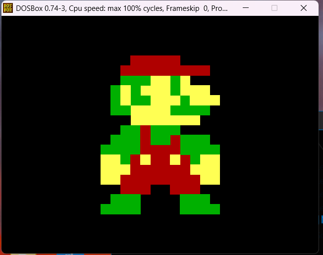
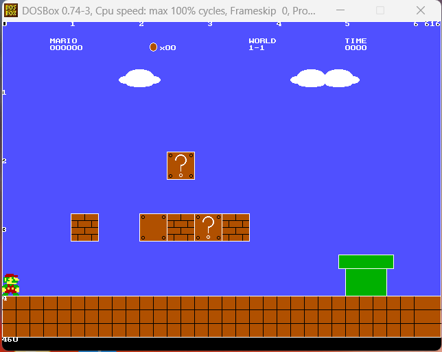

# 🍄 Mario C++ Graphics Archive: A Legacy DOSBox Project (YEAR : 2020)

### 🎓 Engineering Portfolio | Period: 2020
This repository archives a series of development milestones created during my Engineering degree. It demonstrates my early foundations in **Low-Level Programming**, **Coordinate Geometry**, and **Game Loop Logic** using C++ and the legacy `graphics.h` library.

---

## 🚀 Project Overview
The project was developed and tested using the **Turbo C++ IDE** within the **DOSBox 0.74-3** emulator. It represents a hands-on approach to understanding how hardware-level scan codes and pixel-perfect rendering work together to create an interactive experience.

### 📈 Evolution of Development

#### Milestone 1: Sprite Vector Rendering
Focuses on manual pixel-coordinate mapping. I calculated the vertices for the Mario character and used `line()` and `floodfill()` functions to render a high-fidelity 16-bit style sprite.
> **Key Skill:** Spatial Data Mapping & Coordinate Systems.


#### Milestone 2: World 1-1 Environment Design
Integrated a static game world including the iconic blue sky, clouds, brick platforms, and green pipes. This phase required managing multiple layers of rendering without a modern "Game Engine."
> **Key Skill:** Layered Data Visualization.

#### Milestone 3: Interactive Movement Engine
Implemented a real-time input system using **Keyboard Scan Codes** (e.g., 77 for Right, 72 for Up). The logic handles basic 4-way movement by updating object coordinates based on user interrupts.
> **Key Skill:** Event-Driven Logic & Input Buffering.

---

### 📸 Visual Demos

#### Milestone 1: Sprite Rendering
This shows the pixel-mapped Mario rendered in DOSBox.


#### Milestone 2: Level 1-1 Environment
This shows the full background with platforms and the green pipe.


---

## 🛠️ Technical Stack & Tools
* **Language:** C++
* **Graphics Library:** `graphics.h` (BGI - Borland Graphics Interface)
* **Environment:** DOSBox 0.74-3 Emulator
* **Concepts:** * Hardware Interrupt Handling (Scan Codes)
    * Seed-Fill Algorithms (`floodfill`)
    * Relative Positioning Logic

---

## 💡 Connection to Data Engineering
While this is a game project, the core logic translates directly to my current work in Data Engineering:
* **Pipelines:** The Game Loop is the ultimate real-time data pipeline (Input -> Transform -> Output).
* **Optimization:** Rendering complex shapes with minimal calls is a lesson in resource management and computational efficiency.
* **Geospatial Logic:** Mapping Mario's coordinates is functionally identical to handling $X,Y$ coordinate data in modern spatial datasets.

---

## 📂 Repository Structure
```text
/Mario-CPP-Project
├── /v1-Sprite-Rendering   # Milestone 1: Pixel mapping logic
├── /v2-Level-Design       # Milestone 2: Environment & UI design
├── /v3-Movement-Engine    # Milestone 3: Input handling & box movement
└── /screenshots           # Project visual assets
